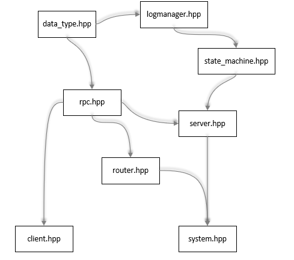

# A Simple demo of Raft Consensus Algorithm

## Brief Introduction of Raft

Raft is a consensus algorithm firstly applied in distributed system to ensure the normal processing of system. During the running of system, the time is seperated into terms. In each term, there will be at most one leader(or no leader for election failure). Only the leader can solve the command requests from user client, and new log entries will be replicated from leader to followers. Followers can be candidate if after a period of time not receive anything from leader. After a follower becomes a candidate, it firstly vote for itself and then send `Request Vote RPCs` to all other servers. The candidate who receives majority votes become leader for new term.

This project use linux socket to communicate between servers. Though Linux has already provided `RPC` functions. However I just want to have a try to use the basic network communication protocal.

## Requirements

OS: Linux; 
GCC: at least support c++ std11; 
GLOG: recommend latest version, repo site: https://github.com/google/glog
json: for json file parse, recommend latest version, repo site: https://github.com/nlohmann/json

## Project structure

The general structure of the project is as shown in the below image.

`data_type.hpp` contains the definition of the log entry structure;

`rpc.hpp` contains the structure definition of different kinds of RPC calls. They are defined as structure and with `serialize` and `deserialize` function.

`router.hpp` act as the opaque router in the system. Buiding connections for each pair of servers is not a fine practice. The opaque server's job is receiving and redirect messages.

`log_manager.hpp` contains log and corresponding methods to manage the log entries for a server.

`server.hpp` constains the processing procedure of a server in the system

`system.hpp` is the start point of the total system. It will load configure file and start opaque router and server instances.

## The basic procedure

After running the demo, it will first load and parse json format configure file and create instances. The opaque router will firstly started and then comes with servers. In `main.cpp` the client load KV pairs from file and wait for seconds the system ready(leader elected). Then the client send KV pairs to the system(Note that the maximum length is 8, which can be changed in `rpc.hpp`). The received server may not be the leader, but the request will finally redirect to the leader. After the leader receives the entries from client, the server send `AppendEntries RPCs` to followers to replicate entries. The entries replicated on major followers will finally be applied on state machine.

You can get the status of the system from the logs.

## At the end

It is easier to prove wrong but harder to prove right. Please feel free to issue bugs.
